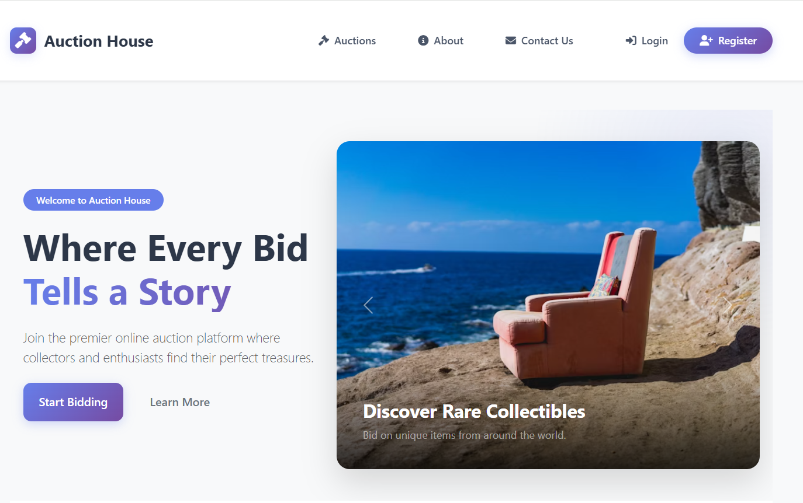

# DotNetProject

A modern Auction Platform built with a .NET (C#) backend and a React frontend.

## 🚀 Project Overview
- **Backend:** ASP.NET Core Web API (C#)
- **Frontend:** React (JavaScript)
- **Database:** MySql
- **Features:**
  - User registration, login, and role-based access (Admin/User)
  - Create, edit, and delete auctions (Admin)
  - Place bids and view bid history (User)
  - Secure image upload and local storage
  - Responsive, modern UI
  - **Order History tab in User Dashboard:** Users can now view all their past orders and download/view receipts for each order directly from the dashboard.

## 📸 Screenshots

### Home


### Auction List


### Auction Detail & Bidding


### Admin Dashboard


### User Bid History


## 📁 Folder Structure
```
DotNetProject/
  backend/    # .NET backend (API, models, DB, controllers)
  frontend/   # React frontend (UI, components, context)
  README.md   # This file
  Web.config  # IIS/ASP.NET config
```

## ⚙️ Setup Instructions

### 1. Backend (.NET)
```bash
cd backend
# Restore dependencies
 dotnet restore
# Run the API server
 dotnet run
# (Optional) Apply DB migrations
 dotnet ef database update
```

### 2. Frontend (React)
```bash
cd frontend
# Install dependencies
 npm install
# Start the React app
 npm start
```

- The backend runs on `http://localhost:5100` by default.
- The frontend runs on `http://localhost:3000` by default.

## 📝 Usage
- Register as a user or login as admin (`admin@auction.com` by default)
- Admins can create, edit, and delete auctions (image required)
- Users can view auctions, place bids, and see their bid history
- **Users can now view their Order History and download/view receipts for all completed orders from the dashboard.**
- All images are stored locally in the backend's `wwwroot/images/` folder


Happy Bidding! 